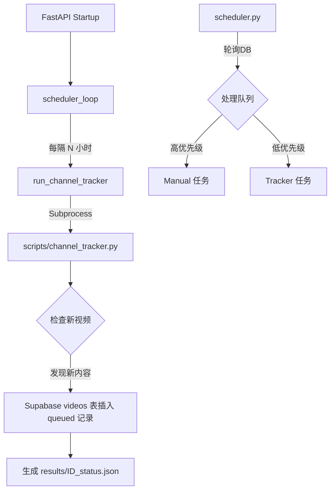

# 频道自动追踪系统设计文档 (Channel Tracking System)

## 1. 概述
本系统负责自动监测已订阅的 YouTube 频道更新，并将新发布的视频排队进入处理流程。其核心目标是在保证系统负载安全（防风控、控成本）的前提下，实现内容的自动化聚合。

## 2. 核心配置参数
配置主要位于 `backend/main.py`：

| 参数 | 当前值 | 说明 |
| :--- | :--- | :--- |
| `CHANNEL_CHECK_INTERVAL_HOURS` | `1` | 检查频率。每小时扫描一次所有已录入频道。 |
| `MAX_VIDEOS_PER_HOUR` | `5` | 每小时新增视频限额。超出部分的更新将留待下一周期。 |
| `MAX_VIDEOS_PER_DAY` | `50` | 每日总限额。防止因频道突发大量历史更新导致配额耗尽。 |

## 3. 运行机制
系统采用基于 FastAPI 生命周期和独立进程的协同模式：

## 4. 关键设计考量

### 4.1 顺序调度 (Sequential Processing)
`scheduler.py` 严格按照“一个接一个”的原则处理任务。
- **优点**：天然控制并发负载，避免多个 Whisper 模型运行导致 GPU/CPU 过载。
- **限制**：背景任务处理较慢时，可能会产生堆积。

### 4.2 设置限额的原因
虽然顺序执行是安全的，但保留 5/hr & 50/day 的限额旨在解决以下风险：
- **YouTube 风控**：`yt-dlp` 的频繁请求（即便有 Cookie）可能导致 IP 被暂时封锁。较低的抓取频率显著降低该风险。
- **LLM 费用保护**：防止因订阅频道突发上百个视频导致 `gpt-4o-mini` 账单超出预期。
- **保障响应延迟**：背景任务即便插队，也必须等待当前正在处理的那一个视频结束。限制视频总量可以缩短“最长等待时间”。

### 4.3 优先级机制
系统通过 Supabase 的 `report_data->source` 字段区分：
- `manual`：用户手动粘贴链接提交（优先级最高）。
- `tracker`：本追踪系统自动检获的内容。
`scheduler.py` 会优先处理所有 `manual` 任务，确保用户的主动交互体验。

## 5. 运维与调整
- **调整限额**：直接修改 `backend/main.py` 中的常量并重启服务。
- **开关频道**：在 `channel_settings` 表中，将 `track_new_videos` 设置为 `False` 即可停止特定频道的追踪。
