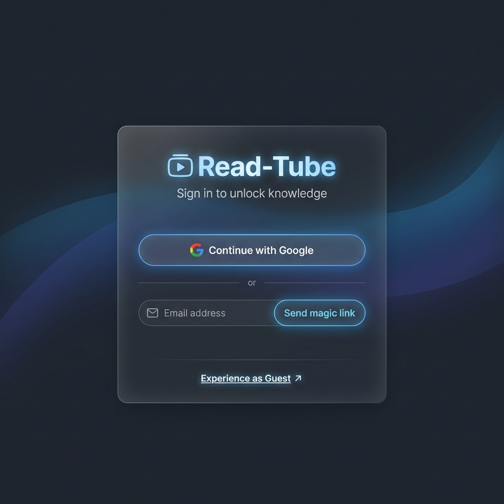
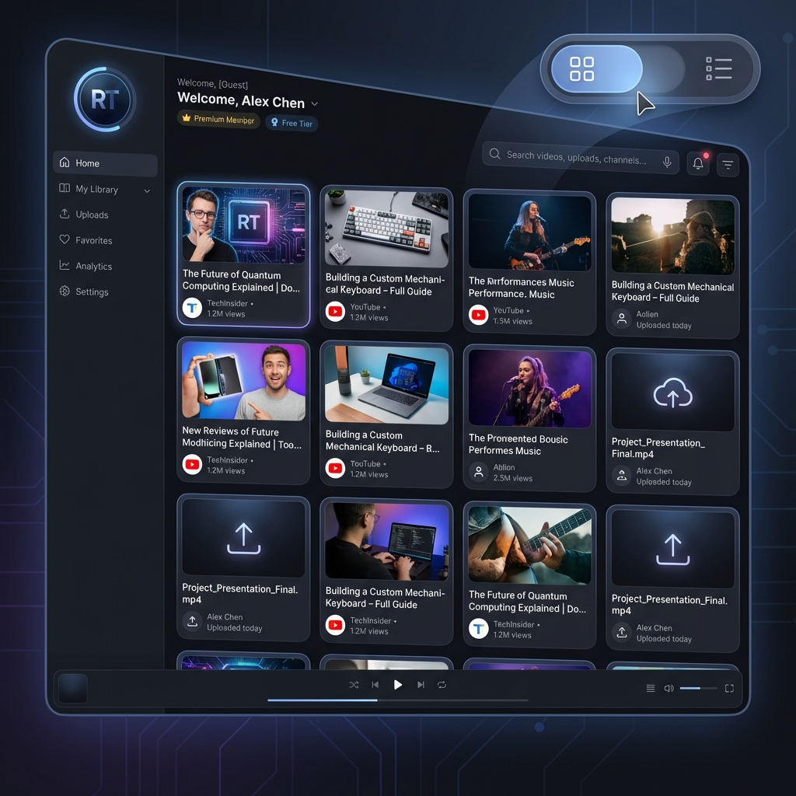
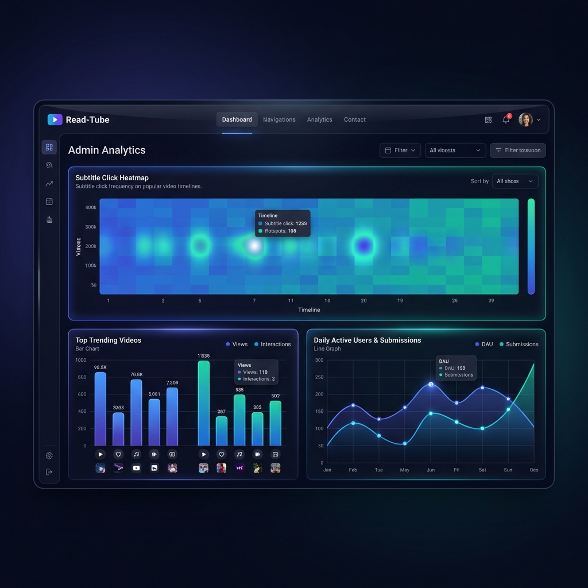
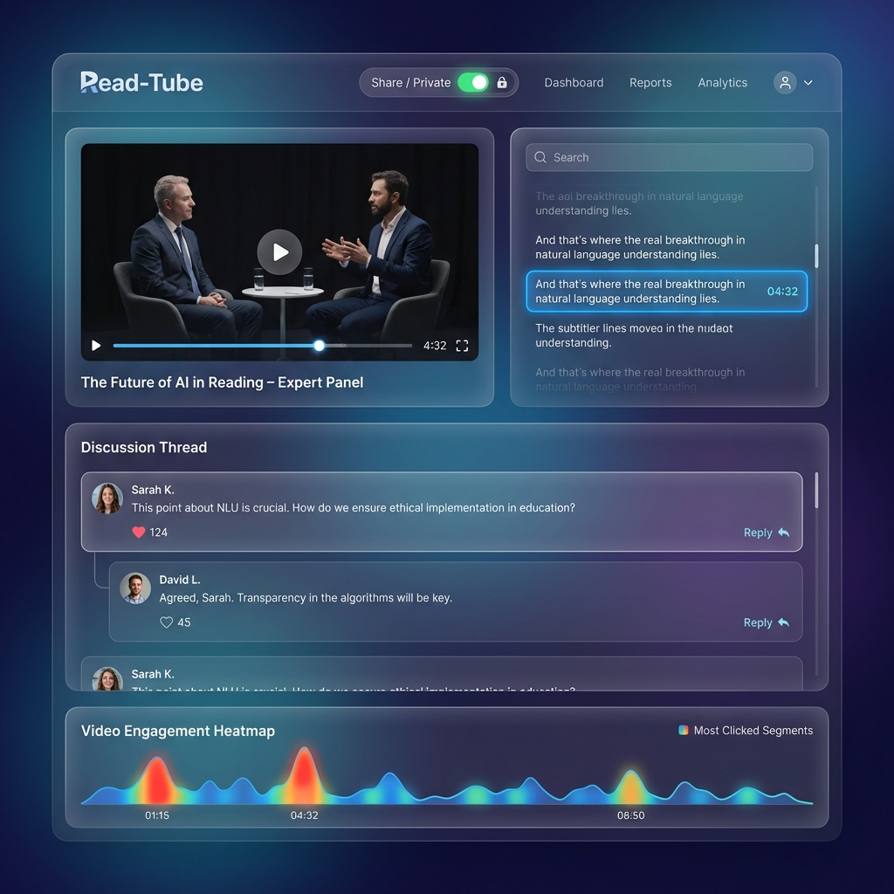

# Read-Tube 第一轮 UI 原型演示

为了确保我们在进入数据库和后端开发前达成共识，我基于调整后的计划为您生成了三个核心页面的高保真设计原型。这些设计采用了现代深色模式与玻璃拟态风格，力求营造高端、专业的视觉体验。

## 1. 登录页 (Gateway)
重点展示了多种登录入口的融合。

````carousel

<!-- slide -->
### 设计亮点：
*   **多维登录**：Google 登录作为首选高亮展示。
*   **访客入口**：底部显眼的“Experience as Guest”，点击即可免登录进入 Dashboard 的演示模式。
*   **视觉风格**：深色背景配合微妙的冷色调光晕，符合高端知识工具的定位。
````

## 2. 统一仪表盘 (Unified Dashboard)
展示了用户（及 Guest）管理内容的中心。

````carousel

<!-- slide -->
### 设计亮点：
*   **视图切换**：右上角提供“预览图/仅标题”一键切换（如图所示为预览图模式）。
*   **内容来源分析**：卡片上清晰标注 YouTube 图标或本地上传图标。
*   **Guest 数据**：访客进入后将在此处看到自动填充的最近 5 条 YouTube 报告。
*   **权限指示**：每个卡片都会清晰显示其“私有/共享”状态。
````

## 3. 管理者汇总页 (Admin Insight) - Mock 展示
展示全站运营热度与用户行为深度分析。

````carousel

<!-- slide -->
### 设计亮点：
*   **热度热力图 (Heatmap)**：动态展现用户在观看视频时点击字幕的频率分布。
*   **排行榜**：全网浏览量与互动量最高视频的一目了然。
*   **趋势分析**：日活与提交量的波动曲线，使用拟定的模拟数据展示。
````

## 4. 增强版报告页 (Enhanced Report with Discussion)
视频观看与社交反馈的核心载体。

````carousel

<!-- slide -->
### 设计亮点：
*   **私有/共享切换**：顶部显眼的开关按钮，赋予用户绝对的隐私控制权。
*   **嵌套评论区**：支持多级回复（如图所示），方便针对特定转录内容进行深度讨论。
*   **互动热度图**：在页面底部实时展示该视频“被点击最多”的时间段，引导用户发现重点。
````

---

## 核心设计确认：基于 UI 推导的数据库模型 (DB Schema)

通过以上 UI 原型的迭代，我们锁定了以下必须记录的数据维度：

### 1. 视频与权限 (Videos & Submissions)
*   `is_public`: 控制报告的可见性（全局唯一标识）。
*   `view_count`: 后台自动统计，用于展示热度。

### 2. 社交互动 (Comments)
*   `parent_id`: 数据库需支持自关联逻辑，以处理 UI 上的嵌套回复。
*   `likes_count`: 计数器，记录反馈的认可度。

### 3. 精准行为埋点 (Analytics)
*   `event_data`: 需存储 `subtitle_index` (点击了第几段) 和 `offset_seconds` (跳转的时间点)，以便生成分析页的热力图。

---

## 接下来我需要您的反馈：
1. **最终确认**：这套包含“登录-仪表盘-分析-报告”的视觉与交互体系是否可以定稿？
2. **下一步计划**：如果您确认，我将立即进入 **阶段二：编写并执行 SQL 脚本**。

**您认为是否还有需要微调的视觉元素或交互逻辑？**
